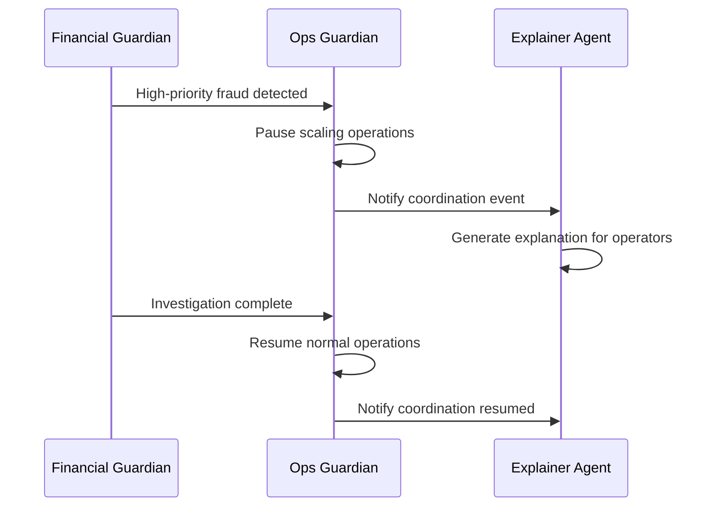

# 🏗️ Ops Guardian Infrastructure Guide

**Deep Dive into Intelligent Infrastructure Monitoring & Auto-Scaling**

---

## 🎯 **Architecture Overview**

The Ops Guardian Agent is built as a cloud-native microservice that bridges the gap between traditional infrastructure monitoring and intelligent AI-driven operations. It's designed to understand not just *what* is happening in your infrastructure, but *why* it's happening and *what* should be done about it.

### **Core Components**

#### **1. KubernetesMonitor**
The eyes and hands of the system - monitors cluster state and executes scaling operations.

```python
class KubernetesMonitor:
    - Connects to Kubernetes API (in-cluster or local kubeconfig)
    - Monitors deployments, pods, and resource usage
    - Executes scaling operations via Kubernetes API
    - Maintains metrics cache for performance
```

**Key Features:**
- **Adaptive Connection**: Works both in-cluster and with local development
- **Resource Tracking**: Monitors CPU, memory, response times, error rates
- **Safe Scaling**: Enforces min/max replica limits and gradual scaling
- **Error Handling**: Graceful degradation when Kubernetes API is unavailable

#### **2. TrafficPredictor**
The brain of the system - uses AI to make intelligent scaling decisions.

```python
class TrafficPredictor:
    - Integrates with Google Gemini AI for pattern recognition
    - Analyzes historical metrics and time-based patterns
    - Considers banking-specific context (business hours, paydays)
    - Provides fallback rule-based logic
```

**AI Analysis Context:**
- **Temporal Patterns**: Hour of day, day of week, seasonal variations
- **Business Context**: Banking traffic patterns, financial service requirements
- **Historical Data**: Learning from past scaling decisions and outcomes
- **Risk Assessment**: Balancing performance vs cost optimization

#### **3. OpsGuardian Orchestrator**
The coordinator - manages the monitoring loop and multi-agent integration.

```python
class OpsGuardian:
    - Orchestrates monitoring and scaling operations
    - Manages multi-agent coordination
    - Handles pause/resume logic for coordination
    - Integrates with other Guardian agents
```

---

## 📊 **Monitoring Strategy**

### **Metrics Collection**
The Ops Guardian collects comprehensive metrics from multiple sources:

#### **Kubernetes Native Metrics**
```yaml
Deployment Metrics:
  - current_replicas: Currently running pods
  - desired_replicas: Target replica count
  - ready_replicas: Healthy, ready pods
  - updated_replicas: Pods with latest image

Pod Metrics:
  - phase: Running/Pending/Failed status
  - resource_usage: CPU and memory consumption
  - restart_count: Container restart frequency
```

#### **Application Performance Metrics**
```python
Service Metrics:
  - response_time_avg: Average API response time
  - request_rate: Requests per second
  - error_rate: Percentage of failed requests
  - throughput: Successful transactions per minute
```

#### **Simulated vs Real Metrics**
For demonstration purposes, the Ops Guardian includes realistic metric simulation:

```python
# Realistic CPU usage simulation
cpu_usage = min(85.0, max(10.0, hash(service_name + str(int(time.time() / 60))) % 80 + 10))

# Response time correlation with CPU
response_time_avg = base_response_time + (cpu_usage - 50) * 2

# Error rate increases with high CPU
error_rate = max(0, min(5, (cpu_usage - 70) * 0.5)) if cpu_usage > 70 else 0
```

**Production Integration Points:**
- **Prometheus/Grafana**: For comprehensive metrics collection
- **Kubernetes Metrics Server**: For real resource usage data
- **Application Metrics**: Custom metrics from Bank of Anthos services
- **External Monitoring**: Integration with cloud provider monitoring

---

## 🧠 **AI-Powered Scaling Logic**

### **Gemini AI Integration**
The Ops Guardian leverages Google Gemini to make intelligent scaling decisions:

#### **Context Preparation**
```python
context = {
    "service": metrics.service_name,
    "current_metrics": {
        "cpu_usage": metrics.cpu_usage,
        "memory_usage": metrics.memory_usage,
        "response_time": metrics.response_time_avg,
        "request_rate": metrics.request_rate,
        "error_rate": metrics.error_rate
    },
    "time_context": {
        "hour_of_day": hour,
        "day_of_week": day,
        "is_business_hours": 9 <= hour <= 17,
        "is_weekend": day >= 5
    },
    "historical_patterns": recent_metrics[-5:]
}
```

#### **AI Prompt Engineering**
The system uses carefully crafted prompts that include:

**Banking Domain Knowledge:**
- High availability requirements for financial services
- Typical banking traffic patterns (lunch rush, paydays, month-end)
- Error tolerance thresholds for financial transactions
- Cost optimization opportunities during off-hours

**Technical Context:**
- Current resource utilization and performance metrics
- Historical scaling decisions and their outcomes
- Service dependencies and cascade effects
- Infrastructure constraints and limits

#### **Decision Validation**
```python
# AI response validation
if not ai_result.get('should_scale', False):
    target_replicas = metrics.current_replicas
else:
    # Enforce safety limits
    target_replicas = max(1, min(10, ai_result.get('target_replicas')))

# Confidence scoring
confidence = max(0.0, min(1.0, ai_result.get('confidence', 0.7)))
```

### **Fallback Rule-Based Logic**
When AI is unavailable, the system uses proven rule-based scaling:

```python
# Scale-up conditions
should_scale_up = (
    metrics.cpu_usage > 75 or          # High CPU usage
    metrics.memory_usage > 80 or       # High memory usage
    metrics.response_time_avg > 500 or # Slow response times
    metrics.error_rate > 1.0           # Error rate threshold
)

# Scale-down conditions (with business hours consideration)
should_scale_down = (
    metrics.cpu_usage < 30 and 
    metrics.memory_usage < 40 and
    metrics.response_time_avg < 200 and
    metrics.error_rate < 0.1 and
    not is_business_hours              # Only during off-hours
)
```

---

## 🔄 **Multi-Agent Coordination**

### **Coordination Scenarios**

#### **Fraud Investigation Priority**


#### **Resource Conflict Resolution**
```python
def _execute_scaling_decision(self, decision: ScalingDecision):
    # Check for coordination requirements
    if decision.coordination_needed:
        fraud_status = self._check_fraud_investigations()
        if fraud_status.get("active_investigations", 0) > 0:
            # Defer scaling during fraud investigations
            self._notify_explainer_coordination("scaling_deferred", {
                "service": decision.service_name,
                "reason": "Active fraud investigations take priority"
            })
            return
    
    # Execute scaling if no conflicts
    success = self.k8s_monitor.scale_service(decision.service_name, decision.target_replicas)
```

### **Event Correlation**
All scaling events include correlation IDs for multi-agent tracking:

```python
event_data = {
    "event_type": "system_scaling",
    "source_service": "ops-guardian",
    "severity": "medium",
    "context": {
        "service_name": decision.service_name,
        "from_replicas": decision.current_replicas,
        "to_replicas": decision.target_replicas,
        "reason": decision.reason,
        "confidence": decision.confidence
    },
    "audience": "operator",
    "correlation_id": str(uuid.uuid4())
}
```

---

## 🔒 **Security & Permissions**

### **Kubernetes RBAC**
The Ops Guardian requires specific permissions to function:

```yaml
# ClusterRole permissions
rules:
- apiGroups: ["apps"]
  resources: ["deployments"]
  verbs: ["get", "list", "watch", "patch", "update"]
- apiGroups: [""]
  resources: ["pods"]
  verbs: ["get", "list", "watch"]
- apiGroups: ["metrics.k8s.io"]
  resources: ["pods", "nodes"]
  verbs: ["get", "list"]
```

### **Security Best Practices**
- **Non-root containers**: Runs as user ID 1000
- **Read-only filesystem**: Prevents runtime modifications
- **Dropped capabilities**: Removes unnecessary Linux capabilities
- **Resource limits**: Prevents resource exhaustion
- **Network policies**: Restricts network access (when configured)

### **Secret Management**
```yaml
# Gemini API key stored securely
- name: GEMINI_API_KEY
  valueFrom:
    secretKeyRef:
      name: guardian-secrets
      key: GEMINI_API_KEY
```

---

## 📈 **Performance Optimization**

### **Monitoring Loop Efficiency**
```python
# Optimized monitoring cycle
while self.monitoring_active:
    try:
        # Collect metrics from all services (parallel)
        current_metrics = {}
        for service in self.k8s_monitor.monitored_services:
            metrics = self.k8s_monitor.get_service_metrics(service)
            # ... process metrics
        
        # Sleep before next cycle
        time.sleep(30)  # 30-second monitoring interval
```

### **Metrics Caching**
```python
# Efficient metrics storage
self.metrics_history[service].append(metrics.to_dict())

# Limit historical data
if len(self.metrics_history[service]) > 100:
    self.metrics_history[service] = self.metrics_history[service][-100:]
```

### **Resource Usage**
- **CPU**: 250m requests, 500m limits
- **Memory**: 256Mi requests, 512Mi limits
- **Storage**: Ephemeral storage for logs and cache
- **Network**: Minimal bandwidth for API calls

---

## 🎯 **Scaling Strategies**

### **Conservative Scaling**
Default approach for production environments:
- **Scale up**: One replica at a time
- **Scale down**: Only during off-hours
- **Safety margins**: Never scale below 1 replica
- **Gradual changes**: Allow time for metrics to stabilize

### **Aggressive Scaling**
For high-traffic scenarios:
- **Predictive scaling**: Scale before metrics degrade
- **Batch scaling**: Multiple replicas when needed
- **Proactive approach**: Use AI predictions heavily
- **Performance priority**: Favor availability over cost

### **Banking-Specific Logic**
```python
# Banking context awareness
banking_patterns = {
    "lunch_rush": (12, 14),      # 12 PM - 2 PM
    "payroll_days": [1, 15, 30], # Common payroll dates
    "month_end": (28, 31),       # Month-end processing
    "business_hours": (9, 17)    # 9 AM - 5 PM
}
```

---

## 🚀 **Future Enhancements**

### **Advanced AI Features**
- **Anomaly Detection**: Identify unusual traffic patterns
- **Predictive Maintenance**: Forecast infrastructure issues
- **Cost Optimization**: AI-driven resource allocation
- **Multi-region Scaling**: Coordinate across regions

### **Enhanced Monitoring**
- **Custom Metrics**: Application-specific monitoring
- **Real-time Alerting**: Integration with PagerDuty/Slack
- **Performance Baselines**: Dynamic threshold adjustment
- **Capacity Planning**: Long-term resource forecasting

### **Multi-Agent Evolution**
- **Coordinator Agent**: Centralized decision making
- **Security Agent**: Integrated security monitoring
- **Compliance Agent**: Regulatory compliance automation
- **Cost Agent**: Financial optimization focus

The Ops Guardian Agent represents the next evolution of infrastructure management - from reactive monitoring to proactive, AI-driven operations that understand both technical metrics and business context! 🚀
